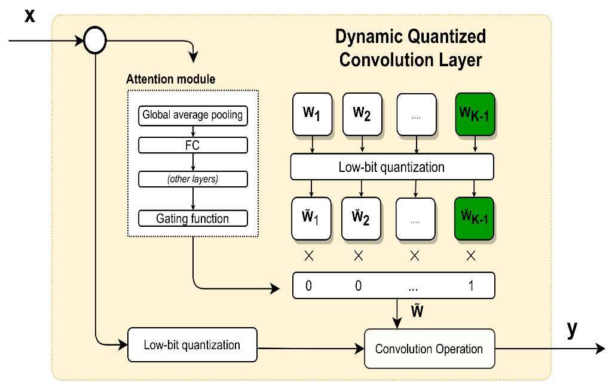

# Model Quantization

## Introduction

Quantization refers to techniques for performing computations and storing tensors at lower bitwidths than floating point precision. A quantized model executes some or all of the operations on tensors with reduced precision rather than full precision (floating point) values. This allows for a more compact model representation and the use of high performance vectorized operations on many hardware platforms.

Model quantization uses our pre-trained [face detection](https://github.com/shoxa0707/Deploy-yolov8-model-in-different-modules) model for model quantization. Tensorflow is an exception. Tensorflow used a simple model, the MNIST classification model.

## Quantized models

A quantized models have different sizes depending on the type of weights and biases. For example, float32 model will be about 2 times larger than float16 model. So this does not mean that the float16 model is good. As the model becomes lighter, its accuracy decreases. But the working speed of the model also increases. Our quantized model is in [here](https://drive.google.com/drive/folders/1cuayGgh9nsDmE8NouJU-rlWr-01bEYzO?usp=sharing).

### Direction for Deploy

We hope the following links will help you deploy the generated models:

- [Deploy Yolov8 with TensorRT](https://github.com/shoxa0707/Deploy-Yolov8-on-TensorRT)
- [Yolov8 to Google Cloud Platform](https://github.com/shoxa0707/Yolov8-to-GCP)
- [Deploy Yolov8 model in different modules](https://github.com/shoxa0707/Deploy-yolov8-model-in-different-modules)

## Installation

- TensorRT
- Pytorch
- ONNX (with onnxruntime)
- Tensorflow

#### Requirements

- Python >= 3.8
- Linux (Ubuntu 20.04)
- Nvidia GPU
